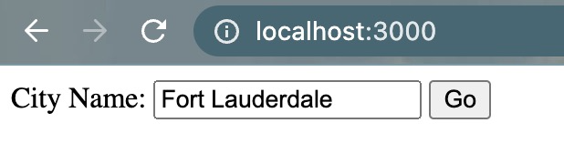
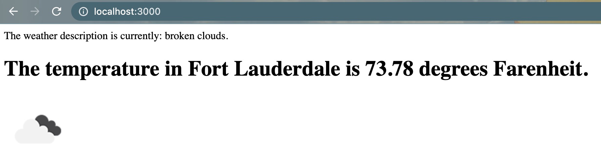

Weather Project Code

This is a weather app which gathers corresponding weather information using an api from https://openweathermap.org/.

This is using Node.js, Express.js and deployed to Heroku server. Can be viewed with localhost when running locally as well. Type in the city name on web page to retrieve the weather description along with the temperature in degrees Farenheit. Also provides an image which corresponds to the type of weather at the time.

---

Note the .env_sample file example of using open weather API_KEY. This uses dotenv to store the personal API as process in code. More info can be found here about dotenv: https://www.npmjs.com/package/dotenv

You will need to create a new .env file for your personal API_KEY. This is where you will store the variable which will be used in the app code.

---

Screenshots

